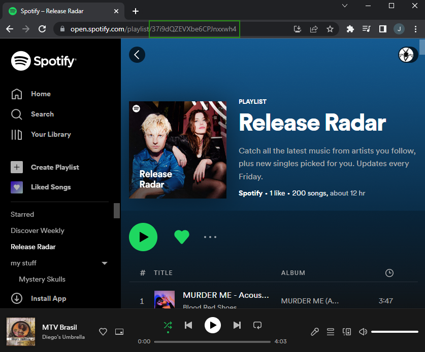
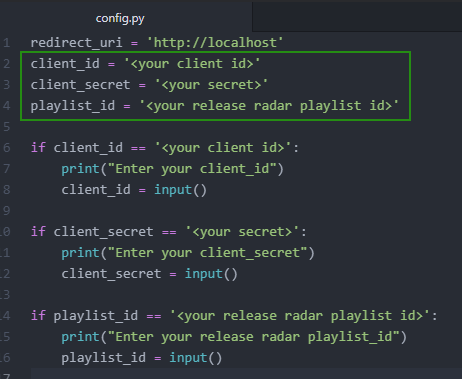
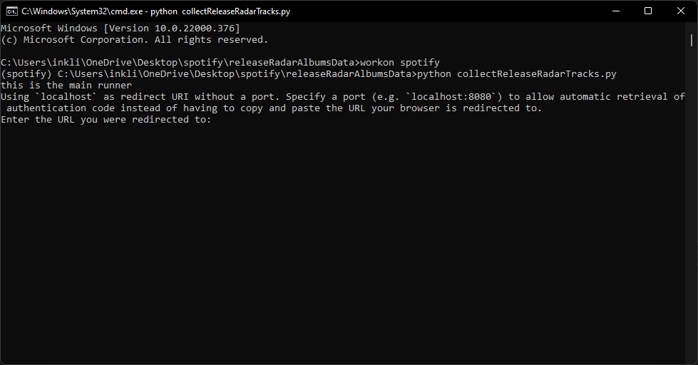
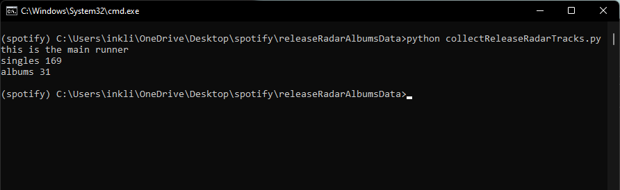

# Python Release Radar Albums

Uses [Spotipy](https://spotipy.readthedocs.io/en/2.19.0/) to read a playlist and determine which tracks belong to albums.
Information about those albums is then written to a json output file.

## Setup
* Install python
* Install Spotipy
  * pip install spotipy
* Refer to [creating an app](https://developer.spotify.com/documentation/general/guides/authorization/app-settings/) to get the necessary info client id and secret.
* Edit config.py
  * Set your spotify client id
  * set your spotify secret
  * set your playlist id
* Run
  * python collectReleaseRadarTracks.py

## output
Once the script is run; open albums.json to gather the album information.

### Setting up / collecting App Information
 * Go to the [Application Dashboard](https://developer.spotify.com/dashboard/applications)
   
 * Create an app give it a name and a description
   
 * Note the client id
 * Click show client secret
  

* Click Edit Settings
  * Set the redirect uri
  
* Use this link https://developer.spotify.com/console/get-current-user-playlists/ To determine which playlist id you want to collect album information from.
  * **OR** open the playlist in the online spotify player and copy the playlist id from the url
  

* Fill in the collected id's into config.py
  
* From a command line install Spotipy
    * pip install spotipy
* From a command line run
    * python collectReleaseRadarTracks.py
* On initial run 2 things will happen.
    * A brower will be opened indicating status **copy** the url in the address bar
    * The command prompt will request that you copy the redirect url into it.
  
* On following runs the script should just run without prompts.
  
* In the out directory is a file named albums.json
