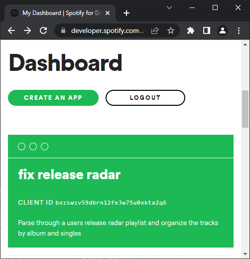
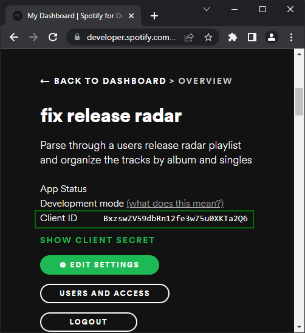
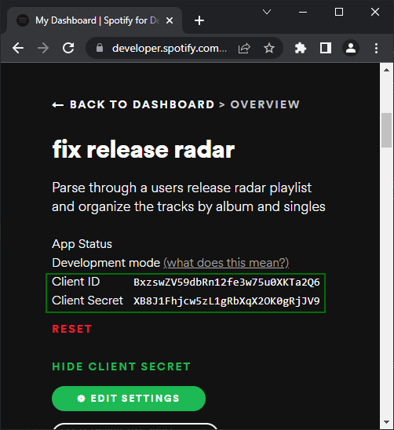
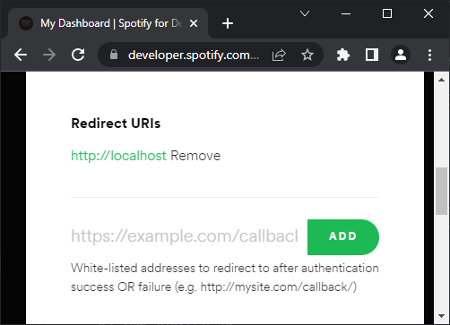

# Python Release Radar Albums

Uses [Spotipy](https://spotipy.readthedocs.io/en/2.19.0/) to read a playlist and determine which tracks belong to albums.
Information about those albums is then written to a json output file.

## Setup
* Install python
* Install Spotipy
  * pip install spotipy
* Refer to [creating an app](https://developer.spotify.com/documentation/general/guides/authorization/app-settings/) to get the necessary info client id and secret.
* (optional) Edit config.py
  * Set your spotify client id
  * set your spotify secret
  * set your playlist id
* Run
  * python collectReleaseRadarTracks.py

## output
Once the script is run; open albums.json to gather the album information.

### Setting up / collecting App Information
 * Go to the Application Dashboard
 
 * Create an app give it a name and a description
 
 * Note the client id
 * Click show client secret

* Click Edit Settings
  * Set the redirect uri

* Use this link https://developer.spotify.com/console/get-current-user-playlists/ To determine which playlist id you want to collect album information from. 
